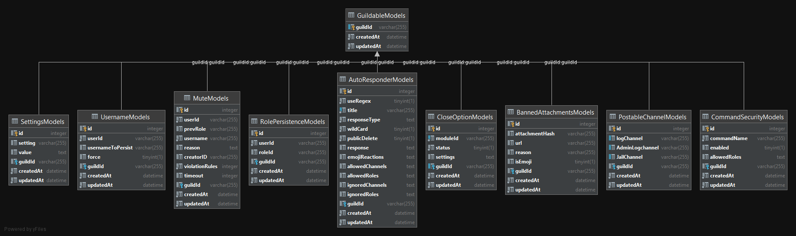

# <ins>Shana</ins>

Shana is a bot with many functions, its initial idea was to completely replace Dyno, as such, to make it more reliable and
faster. After fully implementing both Dyno's AutoRole and AutoMod modules, this bot has expected upon its own custom
automod features and more.

## <ins>Modules</ins>

There are 12 main modules in this bot, each one has its own set of permissions as defined by the`CommandSecurityModels`
database table.

| Module | Description |
| --- | ----------- |
| Ages | commands to get ages of accounts and servers |
| ResourceBanner | Commands deal with banning attachments, embeds and emojis from messages |
| Mute | Commands to mute people from servers |
| Username | Commands to set usernames for people|
| Memes | Commands generate memes. All commands that are marked as type 'attachment' can take both an uploaded image (has to be jpg) OR a mention |
| Bookmarks | Commands to manage bookmarks |
| Help | Commands to display help and info |
| messageschedule | Commands to schedule posts to channels|
| Miscellaneous | Miscellaneous commands |
| closeableModules | Commands to enable or disable modules and commands |
| Music | Commands to play music from Youtube |
| RoleJoiner | Commands to allow users to join vanity roles|
| Settings | Commands to change internal settings of this bot |

you may use the`~help`command for more info about each command and how to call each command complete with mandatory
arguments and examples.

## <ins>Code Structure</ins>

This bot is architected in a way to take heavy use of decorators, DAO's, Managers, Factories, Engines and Dependancy
Injection. It's main design pattern is the decorator pattern with its main underlying framework being Discord.js wrapped
in Discord.ts and with my peristance and service layer on top of it. Each manager that acts as the repository to the DAO
has its own internal cache that works with discord.js's cache to be as performant as possible.

The code is very "interface first", in that any public method outside a singleton is defined in an interface and
abstracted with heavy use of generics and abstract classes, as well as dependency injection that is all loaded on
runtime.

If you are familiar with Java Spring and its way of coding styles, this architecture will seem familiar to you.

## <ins>Dependency Injection</ins>

The main guts of this application is all wired together with the use of a Dependency Injection framework to supply an
Inversion of Control (IOC) architecture to the low level bootstrapping and initialisation of class singletons.

Each class defined by a `@Discord()` or `@singleton()` are all registered with tsyringe's global object registry
container. and is injected into the constructors of classes that need them.

There also exists Spring-link `@PostConstruct` annotations to facilitate the post construction initialisation method
that is called after the object is constructed and resolved

### <ins>Package Design</ins>

This bot has had a lot of care and thought into the package presentation and file structure with a logical and
well-designed methodology.

| Package | Description |
| --- | ----------- |
| api | This is a set of OvernightJS (Express JS decorator wrapper) for the front end HTML interface to communicate with the SQLite DB |
| DI | The definitions used to define dependency injection module as supplied by `tsyringe` |
| commands | All the commands of this bot |
| DAO | The Base DAO of this bot, all Managers or access to the persistence engine will extend this class |
| discord | Main discord.js bootstrap |
| enums | Various enums used within this application |
| events | All events (except`message`events) for this application |
| guards | Guards are pre-processors for commands and events that will be called and evaluate the payload to determine weather to run the function or not |
| managedEvents | Managed events are all the `message`events in the system, the reason for this is to pre-compile the `message` events so that the execution is faster when a message payload arrives |
| model | Model objects such as Entities, Typings, Singleton, Helper classes, Workers, etc...|
| modules | _to be removed_ |
| utils | Util classes |

Interface implementations are always defined in an`impl`folder, interfaces and abstract classes are both treated as
framework objects and not concrete implementations

### <ins>Database</ins>

This bot uses SQLite as persistence, the design of the tables are relatively simple, each table has a cascaded FK on the
master table (guild) table and on the column`guildId`EVERY table has a constraint on this column, and as such, ALL have
a`guildId`

